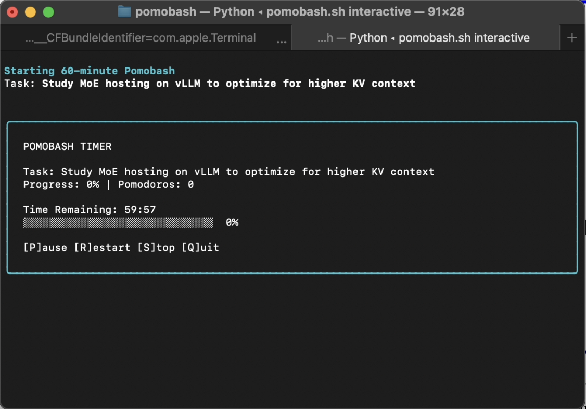
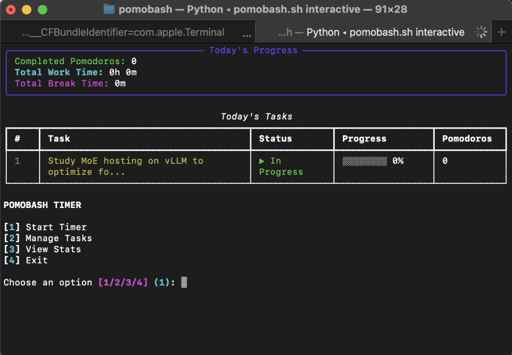

# Pomobash Timer CLI

A beautiful terminal-based Pomodoro timer with task management and productivity tracking.

## Features

- **Multiple Timer Durations**: 24, 40, or 60 minutes
- **Break Times**: 5, 10, or 20 minutes
- **Task Management**: Create, track, and complete tasks
- **Progress Tracking**: Mark completion percentage for each task
- **Rich Terminal UI**: Beautiful interface with colors and progress bars
- **JSON Logging**: All tasks and sessions saved for analysis
- **Productivity Analytics**: Track your work patterns over time

## Screenshots

### Timer in Action

*Beautiful terminal interface with real-time countdown and progress bar*

### Task Management

*Manage your tasks with progress tracking and completion percentages*

## Installation

1. Navigate to the project directory:
   ```bash
   cd ~/work/pomobash
   ```

2. Create virtual environment (if not already created):
   ```bash
   python3 -m venv venv
   ```

3. Install dependencies:
   ```bash
   source venv/bin/activate
   pip install -r requirements.txt
   ```

## Usage

### Quick Start (using launcher script)

```bash
# Start interactive mode
~/work/pomobash/pomobash.sh interactive

# Start a timer directly
~/work/pomobash/pomobash.sh start

# Manage tasks
~/work/pomobash/pomobash.sh tasks

# View statistics
~/work/pomobash/pomobash.sh stats
```

### Alternative (manual activation)

```bash
cd ~/work/pomobash
source venv/bin/activate

# Start a Pomodoro timer
python -m src.cli start

# Manage tasks
python -m src.cli tasks

# View statistics
python -m src.cli stats

# Interactive mode (recommended for beginners)
python -m src.cli interactive
```

### Creating an Alias (Optional)

Add this to your `~/.zshrc` or `~/.bashrc` for easy access:
```bash
alias pomobash='~/work/pomobash/pomobash.sh'
```

Then use simply:
```bash
pomobash start
pomobash tasks
pomobash stats
pomobash interactive
```

## Data Storage

All data is stored in `~/work/pomobash/data/`:
- `tasks.json` - Current day's tasks
- `completed.json` - Historical completed tasks
- `sessions.json` - All Pomodoro sessions for analytics

## Keyboard Shortcuts

**During a timer** (press the key without Enter):
- **P** - Pause/Resume timer (toggle)
- **R** - Restart timer from the beginning
- **S** - Stop timer and exit
- **Q** - Quit timer immediately
- **Ctrl+C** - Emergency stop

**Note**: The timer display updates in real-time. Just press the letter key - no need to press Enter.

## License

MIT
